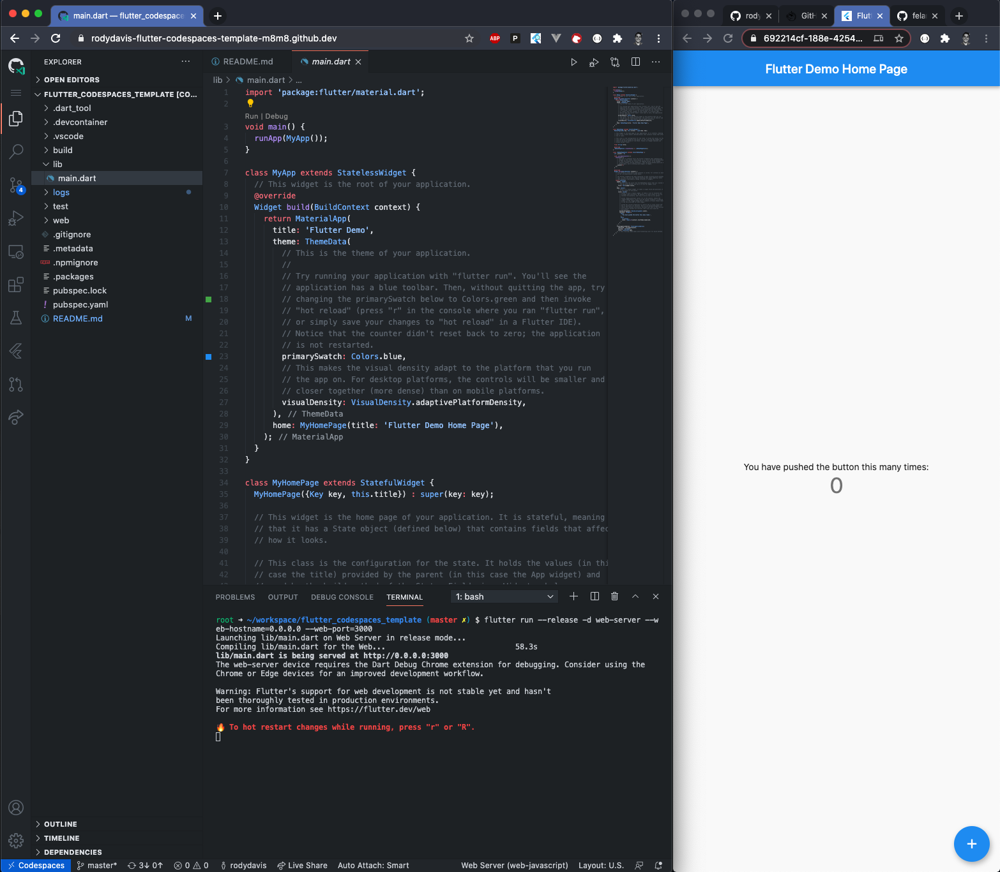

# flutter_codespaces_template

Flutter project that works with Gihub Codespaces. 



## Getting Started

Open this project in Github Codespaces

```
flutter run --release -d web-server --web-hostname=0.0.0.0 --web-port=3000
```

Open url in new tab. You can open the codespace settings and see the port forwarded on the left side of VSCode under the debug icon and is call "remote explorer".

Start coding and enjoy!

More info [here](https://verygood.ventures/blog/github-codespaces-and-run-flutter).